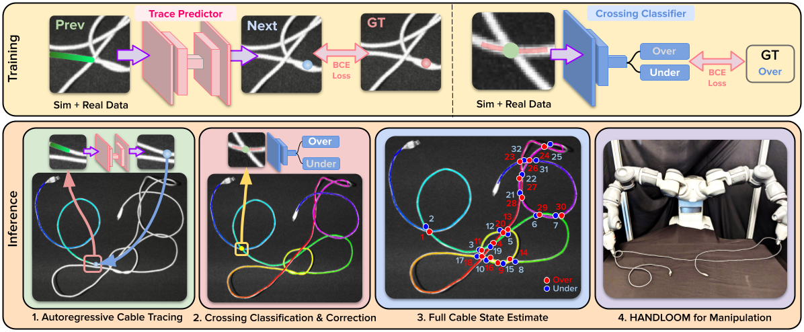
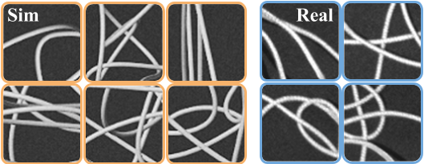
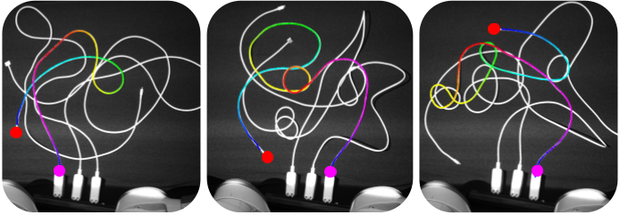
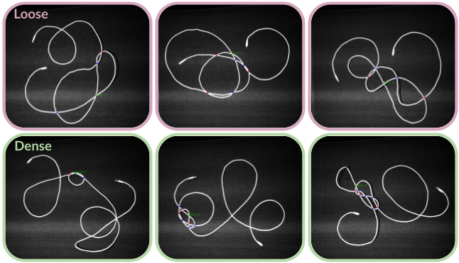

# HANDLOOM: Heterogeneous Autoregressive learNed Deformable Linear Object Observation and Manipulation
HANDLOOM is a cable state estimation pipeline composed of the following components:
1. A learning-based iterative tracer
2. A crossing classifier with a crossing correction algorithm. 

## Installation and Setup 
### Pip Install
To pip install this repository, run the following command:
<pre><code>pip install git+https://github.com/vainaviv/tusk.git
</code></pre>

### Setup.py
1. <pre><code>git clone https://github.com/vainaviv/tusk.git </code></pre>
2. <pre><code>python setup.py install </code></pre>

## Datasets 
Datasets are located inside the ``data`` folder and organized in two categories: ``real_data`` and ``sim_data``. All data comes with an image and the necessary fields for generating ground truth labels. 

``real_data/real_data_for_tracer_viz`` shows examples of real images used in training and test time. 

The ``sim_data`` folders have been clipped to only show a few hundred examples of the train and test points. When training, each training set had ~8,000 examples and each test set had ~200 examples. More data can be generated through Blender. Details on this will be released soon!

## Tracer Model Training 
In ``config.py``, you will find the configuration for the tracer model which we found to work best: ``TRCR32_CL3_12_UNet34_B64_OS_MedleyFix_MoreReal_Sharp``. However, you are able to make your custom configurations by extending the ``BaseConfig`` class and editting hyperparameters accordingly.

To train with the current configuration, run the following command:
<pre><code>python train.py --expt_class TRCR32_CL3_12_UNet34_B64_OS_MedleyFix_MoreReal_Sharp
</code></pre>

To analyze results on crop of sim images, run: 
<pre><code>python analysis.py --checkpoint_path ../model/tracer --checkpoint_file_name tracer_model.pth
</code></pre>

To analyze on full sim images, run: 
<pre><code>python analysis.py --checkpoint_path ../model/tracer --checkpoint_file_name tracer_model.pth --trace_full_cable
</code></pre>

To analyze on full real images, run: 
<pre><code>python analysis.py --checkpoint_path ../model/tracer --checkpoint_file_name tracer_model.pth --trace_full_cable --real_world_trace
</code></pre>

If you train your own custom mode, replace the ``checkpoint_path`` to point to the directory where all checkpoints are saved. ``analysis.py`` will automatically choose the path that had the best score on the validation set. 

Below are example traces.

## Crossing Classification Model Training 
Similar to the tracer, in ``config.py``, you will find the configuration for the tracer model which we found to work best: ``UNDER_OVER_RNet34_lr1e4_medley_03Hard2_wReal_B16_recentered_mark_crossing_smaller``. However, you are able to make your custom configurations by extending the ``BaseConfig`` class and editting hyperparameters accordingly.

To train with the current configuration, run the following command:
<pre><code>python train.py --expt_class UNDER_OVER_RNet34_lr1e4_medley_03Hard2_wReal_B16_recentered_mark_crossing_smaller
</code></pre>

To analyze results on crop of real images, run: 
<pre><code>python analysis.py --checkpoint_path ../model/under_over --checkpoint_file_name uo_model.pth
</code></pre>

Once again, if you train your own custom mode, replace the ``checkpoint_path`` to point to the directory where all checkpoints are saved. ``analysis.py`` will automatically choose the path that had the best score on the validation set. 

Below are example knot detections.

## Evaluating Tracer 
To evaluate the tracer, run:
<pre><code>python tracer.py</code></pre>

This will automatically run traces on test images in ``data/real_data/real_data_for_tracer/test``. Results will be saved to a folder called ``tracer_test``. 

If you train a new tracer model, replace the path to the tracer model checkpoint in the ``__init__`` function of the ``Tracer`` class. 

## Evaluating LTODO applied to Knot Detection
To evaluate LTODO, run: 
<pre><code>python tracer_knot_detection.py</code></pre>

This will run all components of LTODO on the test images in ``data/real_data/real_data_for_tracer/test`` and save results to ``test_tkd``. 

If you train a new tracer model, replace the path to the tracer model checkpoint in the ``__init__`` function of the ``Tracer`` class. If you train a new crossing classification model, replace the path to the classification model checkpoint in the ``__init__`` function of the ``TracerKnotDetector`` class.

## Contributions
If you have any questions or would like to add features, please contact Vainavi Viswanath (vainaviv@berkeley.edu), Kaushik Shivakumar (kaushiks@berkeley.edu), Jainil Ajmera (jainil@berkeley.edu), or Mallika Parulekar (mallika.parulekar@berkeley.edu).
